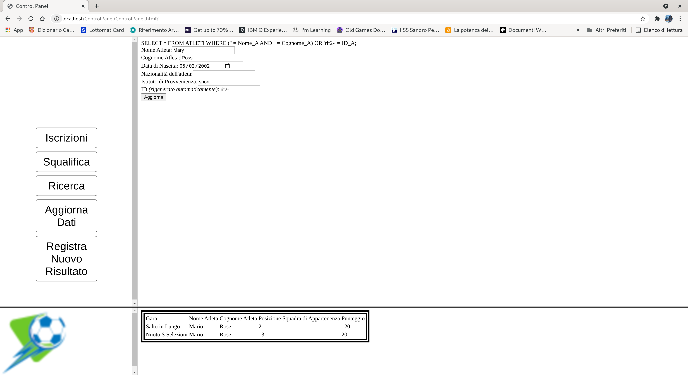

# Gare-Internazionali
---------------------
Progetto DB per la gestione dei risultati di una serie di gare internazionali svolte durante un evento sportivo

## Schemi del Database
---------------------
|**Schema ER del nostro Database**|
|:-----------------------------:|

|**Schema Logico del nostro Database**|
|-----------------------------------|
**ATLETI**( **ID_A**,Nome_A,Cognome_A,Data_N,Istituto,Nazionalita_A,*ID_Sq*)
**SQUADRE**( **ID_Sq**,Nazionalita_Sq,Nome_Sq)
**GARE**( **ID_G**,Nome_G,Tipologia,Punteggio_Max,ID_Se,*ID_F*)
**SEDI**( **ID_Se**,Nome_Se,Città,Nazione)
**FASI**( **ID_F**,Nome_F)
**PARTECIPANO_S**( ***ID_Sq***, ***ID_G***,Punteggio_Sq,Posizione_Sq)
**PARTECIPANO_A**( ***ID_A***,***ID_G***,Punteggio_A,Posizione_A)

## Schema Intermedio del Database finale
-----------------------------------------

## Concept del Sito
-------------------

|Sintesi|
|-------|
Si vuole realizzare un sito web che permetta di visualizzare la classifica degli atleti che partecipano a vari gare all'interno di un campionato nazionale giocato in più luoghi nel mondo, inoltre sempre tramite il sito web gli organizzati potranno modificare i dati relativi agli atleti(e le relative squadre) partecipanti e nello specifico gli sarà permesso di elimina o aggiornare i dati degli atleti o delle squadre già presenti oppure di inserire nuovi atleti e/o squadre con i relativi risultati per ogni gara svolta.

|Index|
|-----|
La prima pagina del sito Web che viene visualizzata dall'utente è quella del login, file ***index.html***, che permette di accedere ai dati della gara previo inserimento di credenziali di accesso; in base alle credenziali si distinguono due tipologie di utenti distinte:   <li>**Organizzatore** può visualizzare i dati del database anche modificarli;   <li>**l'utente** che può solo vedere le informazioni relativi alle classifiche dei partecipante alle varie gare del campionato;  Se un utente non risulta registrato alla piattaforma può registrarsi tramite un form alla piattaforma.  **File di Riferimento**  <li>[index.html](index.html) - [login.php](login.php)<li>[nuovo.html](NuovoUtente/nuovo.html) - [nuovo.php](NuovoUtente/nuovo.php)

|Classifiche|
|-----------|
Il file ***classifica.html*** implementa la pagina web che mostra le classifiche dei giocatori nelle varie gare abbinata a uno script php(***classifica.php***) che ha il compito di reperire i dati dalla base dati per popolare la pagina html. La pagina classifiche è riservata agli utenti che non posseggono particolari credenzialità.  **File di Riferimento**  <li>[classifica.html](classifica.php) - [classifica.php](classifica.php)

|Panello di Controllo|
|--------------------|
La pagina panello di controllo rappresenta il *core* della piattaforma per mezzo di cui i soli organizzatori possono modificare i dati in merito agli atleti ed ai loro risultati. Il file ***ControlPanel.html*** è costituito da una barra di navigazione (panello di sinistra) e un panello principale dove saranno visualizzate le pagine selezionate per mezzo del menu di sinistra. Nel riquadro Principale sono mostrati il file ***elimina.html*** che permette l'eliminazione dei partecipanti alle gare, il file ***ricerca.php*** che permette di compiere ricerche più approfondite sui dati del database in base ai dati dei partecipanti che a quelli delle gare, il file ***aggiungi.html*** per inserire nuovi partecipanti, il file ***seleziona.html*** per aggiornare le informazioni sui partecipanti alle gare ed il file ***registra.html*** che permetterà di inserire i risultati delle varie prestazioni sportive  **File di Riferimento**  <li>[ControlPanel.html](ControlPanel/ControlPanel.html)- [left.html](ControlPanel/left.html) - [right.html](ControlPanel/right.html)<li>[elimina.html](ControlPanel/EliminaAtleta/elimina.html) - [elimina.php](ControlPanel/EliminaAtleta/elimina.php)<li>[ricerca.php](ControlPanel/Ricerca/ricerca.php)<li>[aggiungi.html](ControlPanel/NuovoAtleta/aggiungi.html) - [aggiungi.php](ControlPanel/NuovoAtleta/aggiungi.php)<li>[modifica.html](ControlPanel/ModificaAtleta/modifica.html) - [modifica.php](ControlPanel/ModificaAtleta/modifica.php)<li>[registra.html](ControlPanel/RegistraPunteggio/registra.html) - [registra.php](ControlPanel/RegistraPunteggio/registra.php)

 

## Illustrazione della piattaforma
----------------

|Login|
|-----|
  Questa è la prima pagina mostrata dal sito digitando l'indirizzo, ogni utente per accedere alla piattaforma dovrà essere registrato o come Organizzato(Gode dei massimi privilegi) o come Utente(ha la facoltà di visualizzare unicamente le classifiche del giorno). Per i non registrati si può premere sul bottono registra per creare un account base.

|Registrazione|
|-----|
  In questa pagina tramite l'apposito form è possibile registrarsi alla piattaforma con un account base scegliendo un username e una password che non risultino essere già state inserite.

|Risultato Registrazione|
|-----|
  Se la registrazione va a buon fine si viene rimandati alla pagina del login per utilizzare le nuove credenziali per accedere alla piattaforma

|Login Utente|
|-----|
  Una volta registrati se inseriti in modo coretto i dati nella pagina di login si verrà reindirizzata in questa pagina per chiedere conferma dell'operazione, data l'utente potrà visualizzare esclusivamente i risultati dei singoli atleti nelle varie gare.

|Login Organizzatore|
|-----|
  Nel caso in cui si fa l'accesso con credenziali di Organizzatore verrà visualizzata questa scherma che reindirizzerà l'operatore al pannello di controllo della piattaforma

|Panello di Controllo|
|-----|
  La pagina del Panello di controllo è fondamentale per la piattaforma attraverso di essa si possono gestire la maggiorparte dei dati innerenti agli atleti o squadre parteciapanti agli eventi di gara, inoltre dal medsimo panello si potra osservare la classifica(in basso) degli atleti nelle varie gare.

|Iscrizioni|
|-----|
  Nella sezione è possibile inserire nel sistema nuovi atleti o squadre che hanno preso parte alle gare inserendone le generalità in appositi form.

|Squalifica|
|-----|
  Premendo sul pulsante squalifica la piattaforma permette di selezionare un singolo atleta in base al nome e cognome o codice ID per la squalifica dall'intero evento

|Ricerca|
|-----|
  Premendo sul pulsante Ricerca è possibile visualizzare i dati gestiti dalla piattaforma in base a determinati criteri di ricerca (query)

|Aggiornamento dei dati|
|-----|
  Il pulsante aggiorna dati permette di modificare i dati relativi agli atleti che partecipano al torneo. La pagina il alto permette di selezionare i dati dell'atleta la pagina sotto invece permette di modificare i dati.

|Registrare dei Risultati|
|-----|
  Premendo sul pulsante *Registra Nuovo Risultato* permette di inserire i risultati di gare svolte da un singola atleta (sezione in alto) o pure da una quadra (sezione inferiore).
